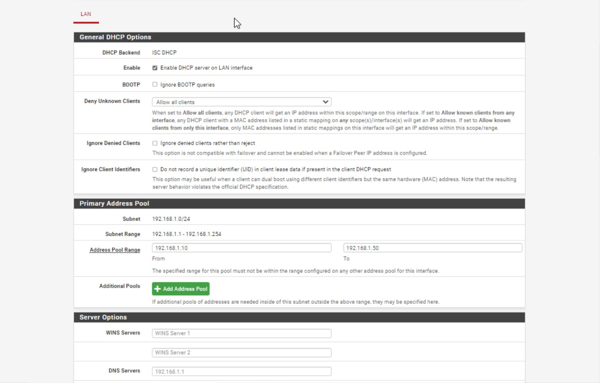
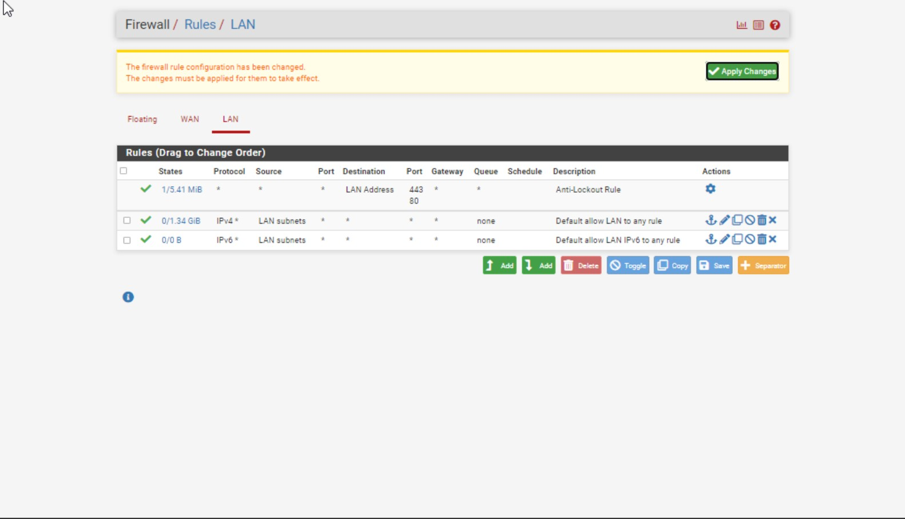
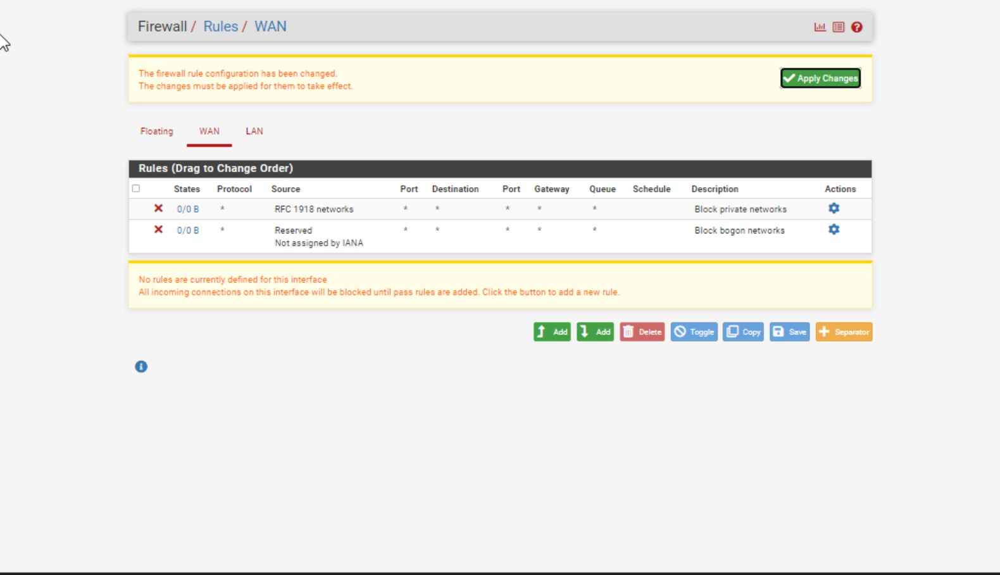

# pfSense Learning Experience

## Introduction

This repository documents my learning experience with pfSense, an open-source firewall and router software distribution. Throughout this journey, I have gained hands-on experience in configuring a secure network environment, including setting up pfSense in a virtual environment and exploring its features.

## Objectives

- Set up and install pfSense in a virtual machine.
- Understand and configure basic network services, including DHCP and firewall rules.
- Learn network security best practices using pfSense.

## Virtual Machine Setup

### 1. Creating a Virtual Machine for pfSense

1. **Choose a Virtualization Platform**:
   - I used VirtualBox (you can use VMware, Hyper-V, etc.).
2. **Download pfSense ISO**:
   - Download the latest pfSense ISO file from the official [pfSense download page](https://www.pfsense.org/download/).
3. **Create a New Virtual Machine**:
   - Open VirtualBox and click **New**.
   - Set a name for the VM (e.g., `pfSense-VM`).
   - Choose **BSD** as the type and **FreeBSD (64-bit)** as the version.
   - Allocate at least **1 GB of RAM**.
4. **Add Network Interfaces**:
   - Add two network interfaces:
     - **WAN Interface**: Set to **Bridged Adapter** for internet access.
     - **LAN Interface**: Set to **Internal Network** for the internal network.
5. **Attach pfSense ISO**:
   - In the **Storage** section of the VM settings, attach the downloaded pfSense ISO file as a virtual optical disk.
6. **Start the VM** and begin the installation process.

### 2. Installing pfSense on the Virtual Machine

1. **Boot from ISO**:
   - Start the VM and boot from the pfSense ISO.
2. **Installer**:
   - Follow the installer prompts to install pfSense to the virtual hard disk.
   - When prompted, select **Auto (UFS)** for disk partitioning.
3. **Reboot**:
   - After installation, reboot the VM and remove the ISO from the virtual CD drive.
4. **Initial Console Configuration**:
   - Configure basic settings through the console, including assigning interfaces (WAN and LAN).

### 3. Accessing pfSense Web Interface

1. **Access from Browser**:
   - Once pfSense is installed and running, access the web interface from a client machine by entering `http://192.168.1.1` in a browser.
   - Use the default credentials to log in:
     - Username: `admin`
     - Password: `pfsense`
2. **Initial Setup Wizard**:
   - Complete the initial setup wizard to configure basic settings like hostname, DNS, and admin password.

## Key Features Explored

### 1. DHCP Configuration

- Set up a DHCP server on the LAN interface to assign IP addresses to devices within the network.
- Assigned IP range: `192.168.1.10` to `192.168.1.50`.
- [View DHCP Configuration Notes](./DHCP-Configuration/notes.md)

### 2. Firewall Rules

- Configured firewall rules to manage traffic between the LAN and WAN interfaces.
- Created rules to allow and block specific traffic based on IP addresses and services.
- [View Firewall Rules Documentation](./Firewall-Rules/firewall-rules.md)
- [View Firewall Configuration Screenshots](./Firewall-Rules/screenshots)

### 3. Traffic Monitoring

- Enabled traffic monitoring to observe real-time data flow through the network interfaces.
- Used pfSense's built-in tools to view graphs and logs of network activity.

## Screenshots

## Lessons Learned

- Encountered issues with network interface assignment, which were resolved by reconfiguring the interfaces through the pfSense console.
- Learned how to configure firewall rules and DHCP services to ensure proper network communication.
- Gained a deeper understanding of how pfSense manages network traffic and security.

## Next Steps

- Explore advanced pfSense features like traffic shaping and intrusion detection.
- Set up a virtualized test environment to practice with VLANs and advanced routing.
- Continue documenting additional configurations as I experiment with new features.

## Acknowledgments

- [pfSense Documentation](https://docs.netgate.com/pfsense/en/latest/)
- Various online resources and tutorials that guided my learning process.
